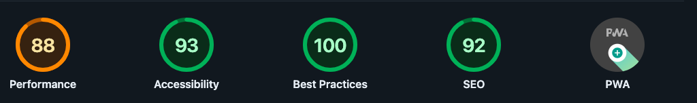

# My 2025 Website Update: Contentful-Powered Theme UI Gatsby Site



## Purpose

This project showcases a dynamic web application built using Gatsby, a modern static site generator, integrated with Contentful CMS for seamless content management. The site features two main content types: notes and recipes, each enriched with multimedia elements and categorized through tags for enhanced navigation and user engagement.

## Key Features

### Dynamic Content Management

- Utilizes Contentful CMS to manage and deliver content for notes and code recipes, allowing non-technical users to easily add, modify, and organize content.
- Theme UI

### Advanced Image Handling

- Implements `gatsby-plugin-image` for optimal image loading with advanced image processing, providing a fast, responsive, and visually engaging user experience.
- Supports modern image formats like WEBP and AVIF, ensuring high performance and efficiency.

### Responsive and Accessible Design

- Features a fully responsive design using custom CSS and Theme UI, ensuring the website is accessible and functional across various devices and screen sizes.
- Focuses on accessibility best practices to cater to a diverse audience, including those with disabilities.

### SEO and Performance Optimized

- Built with SEO best practices in mind, including proper use of headings, meta tags, and alt text for images to enhance search engine visibility.
- Leverages Gatsby's static generation capabilities for blazing-fast load times and optimal web performance.

## Technology Stack

- **Frontend:** Gatsby (React-based framework)
- **CMS:** Contentful
- **Styling:** Styled Components, CSS, and Theme UI
- **Hosting/Deployment:** Netlify, Cloudflare

## Goals

- To create an informative and interactive platform where users can easily access a variety of notes and recipes.
- To demonstrate the integration of a headless CMS with a static site generator for efficient content updates and the performance benefits of static site generation.
- To provide a template or case study for similar projects that require dynamic content management combined with the performance benefits of static site generation.

## TypeScript and Testing

The project uses TypeScript for type checking and Jest for testing React components. Key updates include:

- Adding type declarations for components without existing TypeScript definitions.
- Configuring Jest to run tests in a TypeScript environment.
- Fixing common TypeScript errors related to props and module imports.

### TypeScript Configuration

- **Updated `tsconfig.json`**: The TypeScript configuration was updated to enable the following:
  - `esModuleInterop` for better module compatibility.
  - `jsx` support for React components.
  - Inclusion of all TypeScript files in the `src` directory.

## Responsive Layout with Theme UI

You can create a similar responsive layout using Theme UI by utilizing its responsive array syntax and media queries directly in the `sx` prop. Below is an example of how to translate styled section CSS into a Theme UI `Box` component, including responsive values for `column-gap`, `row-gap`, and `padding`:

```jsx
/** @jsxImportSource theme-ui */
import { Box } from 'theme-ui';

const ResponsiveSection = (props) => (
  <Box
    as="section"
    sx={{
      maxWidth: props.maxWidth || '120rem',
      padding: props.padding || '3.9rem 2rem',
      '@media screen and (max-width: 84em)': {
        columnGap: props.columnGap84 || '5rem',
        rowGap: props.rowGap84 || '7rem',
      },
      '@media screen and (max-width: 75em)': {
        columnGap: props.columnGap75 || '2rem',
        rowGap: props.rowGap75 || '6.9rem',
      },
      '@media screen and (max-width: 59em)': {
        columnGap: props.columnGap59 || '1rem',
        rowGap: props.rowGap59 || '6rem',
      },
      '@media screen and (max-width: 34em)': {
        padding: props.paddingSmall || '3rem 0.8rem 2rem 0.8rem',
        rowGap: props.rowGap34 || '5rem',
      },
    }}
    {...props}
  />
);

export default ResponsiveSection;
```

### Explanation

1. **`as="section"`**: The `Box` component is given an HTML element type of `section`, making it functionally equivalent to `styled.section`.
2. **Responsive Styling Using `@media` Queries**: Traditional CSS media queries are used within Theme UI by nesting them inside the `sx` object.
3. **Default Values or Prop-based Values**: Default values are provided for `maxWidth`, `padding`, `columnGap`, and `rowGap`, with the ability to override using props.
4. **Responsive Values for `padding`, `columnGap`, and `rowGap`**: Media queries adjust `padding`, `columnGap`, and `rowGap` at specific breakpoints to match the original styled section CSS.

### Example Usage

To use the `ResponsiveSection` component:

```jsx
import ResponsiveSection from './ResponsiveSection';

const App = () => (
  <ResponsiveSection
    maxWidth="100rem"
    padding="4rem 2rem"
    columnGap84="4rem"
    rowGap84="6rem"
    columnGap75="1.5rem"
    rowGap75="6rem"
    columnGap59="0.5rem"
    rowGap59="5.5rem"
    paddingSmall="2rem 1rem"
    rowGap34="4rem"
  >
    {/* Your content goes here */}
  </ResponsiveSection>
);

export default App;
```

### Key Advantages of Theme UI Implementation

1. **Flexibility**: You can pass different values through props to dynamically change the styling, similar to how styled-components handle props.
2. **Integration with Theme**: Theme UI allows direct integration with your theme tokens (e.g., `colors`, `space`) for a consistent design system.
3. **Readability**: Using the `sx` prop keeps your styles co-located with your component logic, making it easier to manage.

## Deployment Status

[](https://app.netlify.com/sites/gilbertaharocode/deploys)

## References

- [Node](https://www.gatsbyjs.com/docs/reference/config-files/gatsby-node/)
